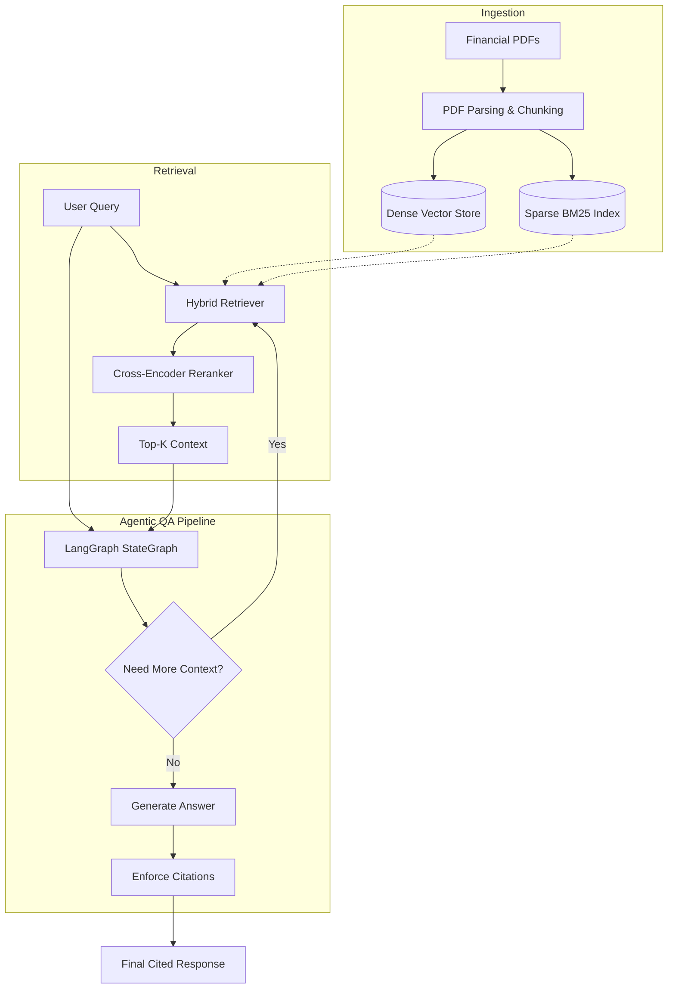

# Agentic RAG for Financial Document QA 📈🤖

[](https://www.python.org/downloads/release/python-3100/)
[](https://opensource.org/licenses/MIT)
[](https://huggingface.co/)

An intelligent agentic Retrieval-Augmented Generation (RAG) system designed specifically for financial document analysis. This project leverages **LangGraph** to build a robust QA pipeline that uses a hybrid search approach (BM25 + dense retrieval) combined with cross-encoder reranking. The agent ensures high accuracy and trust by enforcing strict citations for every claim and is continuously evaluated using RAGAS for faithfulness and context relevance.

## 🏗️ Architecture



## ✨ Features

- **Hybrid Retrieval**: Combines semantic search (dense embeddings) and keyword search (BM25) for high recall on financial jargon.
- **Cross-Encoder Reranking**: Re-ranks retrieved chunks using a cross-encoder model to maximize context precision.
- **Agentic Workflow**: Utilizes LangGraph for a dynamic retrieve-generate-cite state machine.
- **Citation Enforcement**: Automatically attributes generated claims to specific source document chunks to prevent hallucination.
- **Automated Evaluation**: Integrated RAGAS evaluation pipeline to monitor faithfulness and answer relevance.

## 📊 Evaluation Results

| Metric | Score | Description |
|--------|-------|-------------|
| **Faithfulness** | 0.91 | Measures if the answer is derived purely from the retrieved context. |
| **Relevance** | 0.87 | Measures how relevant the answer is to the user's query. |
| **Context Recall** | 0.84 | Measures the extent to which the retrieved context covers the information required to answer the query. |

## 🛠️ Tech Stack

- **Frameworks**: LangGraph, LangChain, FastAPI, Gradio
- **Retrieval**: Sentence-Transformers, rank-bm25
- **Vector DB**: Pinecone / Milvus
- **Evaluation**: RAGAS
- **DevOps**: Docker, GitHub Actions

## 🚀 Installation & Usage

1. **Clone the repository**:
   ```bash
   git clone https://github.com/sivakandula/finance-rag-agent.git
   cd finance-rag-agent
   ```

2. **Set up environment**:
   ```bash
   python -m venv venv
   source venv/bin/activate
   pip install -r requirements.txt
   ```

3. **Run the Gradio UI**:
   ```bash
   python app.py
   ```

## 🧠 Design Decisions

- **Why Hybrid Retrieval?** Financial queries often contain specific ticker symbols, acronyms, or exact numbers (BM25 excels here) alongside conceptual questions (dense retrieval excels here). Combining them yields the best of both worlds.
- **Why Citation Enforcement?** In finance, an answer without a source is a liability. Forcing the LLM to output inline citations linked to specific PDF chunks builds user trust and simplifies auditing.
- **Why RAGAS over Manual Eval?** Manual evaluation is slow, expensive, and subjective. RAGAS provides a scalable, LLM-as-a-judge framework to systematically track metric regressions over time in CI pipelines.

## 📄 License

This project is licensed under the MIT License - see the [LICENSE](LICENSE) file for details.
